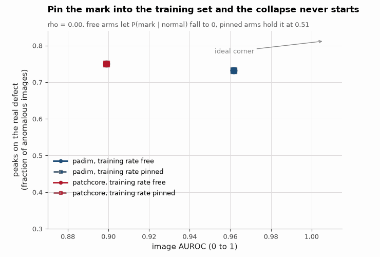

# SpuriousAD, a planted-confound benchmark that refutes its own premise

> The synthetic finding now **replicates on real MVTec images** across two
> detector families and two backbones, see [External validity](#external-validity-real-mvtec-images-two-detectors-two-backbones).
> Pinning the training-set confound rate halves CAR at perfect label
> correlation, so the effect is train-set absence, not a label shortcut.

[](https://github.com/aghasalim/spurious-ad/actions/workflows/ci.yml)
[](https://www.python.org/)
[](LICENSE)

A controlled anomaly-detection dataset where every anomalous image contains a
**true defect** and a spatially-disjoint **spurious mark** correlated with the
label, plus a metric for whether a detector's heatmap lands on the defect or the
mark. Built by a third-year Applied Computer Science (AI) student.

I built it to show that an unsupervised detector can score a perfect AUROC while
pointing at the wrong region. **It doesn't, and finding out why is the result.**

---


---

## Abstract

A natural way to build a controlled Clever Hans benchmark for unsupervised
anomaly detection is to plant an artefact that correlates with the defect label
and then measure whether the detector's heatmap moves onto it. This work builds
that benchmark, reproduces a large effect with it, and then shows the effect is
not the phenomenon it appears to be.

As the planted confound strengthens, image AUROC rises to 0.993 (PaDiM) and 0.998
(PatchCore) while the fraction of heatmap peaks landing on the real defect falls
from about 0.75 to 0.49 and 0.37. Reproducible, and present across categories and
across a backbone swap.

The ablation refutes the interpretation. Raising the confound strength does two
things at once: it makes the artefact predict the label, and it drives the
artefact out of the normal-only training set. Pinning the training confound rate
at 0.465 separates them, and with it pinned, the collapse disappears entirely,
even at the strength where the artefact predicts the label perfectly. In
hindsight this is mechanical: an unsupervised detector never sees a label, so a
label shortcut is not available to it. What it reacts to is a distributional
departure, and flagging that is arguably correct behaviour.

The contribution is therefore negative and methodological. The intuitive
construction produces a real, reproducible, 4.2x effect that has nothing to do
with the phenomenon it claims to study.

**Contributions.** (i) A planted-confound benchmark with a confound attribution
ratio and a random-attribution baseline. (ii) An ablation pinning the training
rate, which removes the effect. (iii) External validity checks across MVTec
categories, two detectors and two backbones. (iv) A negative result about how not
to construct this benchmark.

---

## 1. The headline

Sweeping confound, label correlation ρ from 0 to 1, three seeds, PatchCore-style
detector trained on normal images only (`make sweep`):

| ρ | image AUROC | CAR | CAR random control | peak on defect |
|---|---|---|---|---|
| 0.00 | **1.000** | 0.133 | 0.621 | 93.2% |
| 0.25 | **1.000** | 0.143 | 0.599 | 91.1% |
| 0.50 | **1.000** | 0.144 | 0.588 | 97.4% |
| 0.75 | **1.000** | 0.187 | 0.607 | 93.9% |
| 1.00 | **1.000** | **0.560** | 0.610 | 80.8% |

**AUROC is 1.000 at every level.** The metric the whole field reports is
perfectly blind to whether a spurious mark is driving the score, that part of
the hypothesis holds completely.

CAR (Confound Attribution Ratio, share of heat on the mark rather than the
defect) rises 4.2×. That looks like the predicted collapse. It isn't:

- CAR at ρ=1 is **0.560 against a random-heatmap control of 0.610**. The detector
  never becomes confound-*seeking*; it decays to roughly what uniform noise would
  produce, which is set by the two regions' relative areas.
- The hottest single pixel still lands on the real defect **80.8%** of the time.


## 2. Then the ablation killed the premise outright
The collapse disappears under it, which is what rules out the label-shortcut reading.




*Each detector walks from rho 0 to rho 1 through AUROC against peak on defect. Solid arms let the mark fall out of the normal-only training set, dashed arms pin that rate, and only the solid ones collapse.*

Full detail in [notes/METHODS.md](notes/METHODS.md#2-then-the-ablation-killed-the-premise-outright).
### What this does and does not say about prior work

It does not contradict [Kauffmann et al., *The Clever Hans Effect in Unsupervised
Learning*](https://arxiv.org/abs/2408.08041). They audit models post-hoc on native
data and find Clever Hans effects arising from **inductive bias in the learning
machinery**. That is a different mechanism from label correlation, and nothing here
tests it. What this repo shows is that the intuitive way to *construct* a
controlled version of their setting does not reproduce the phenomenon, because it
smuggles in a distributional artefact instead.

It is also not a criticism of [AUPIMO](https://arxiv.org/abs/2401.01984), whose
X-axis already penalises false positives on normal images. CAR differs in having a
notion of a **specific competing region**, which is what makes "the heat went
*there* instead" measurable at all.

---

## 3. The metric
``` CAR = mass(confound) / (mass(defect) + mass(confound)) ``` over a normalised heatmap, on anomalous images that carry a confound.


Full detail in [notes/METHODS.md](notes/METHODS.md#3-the-metric).
## 4. Running it

```bash
make setup && make test
```

8 tests, all on the generator and metric, the instrument, not the model.

```bash
make sweep && make mechanism
```

CPU or Apple MPS, a few minutes each. No dataset download: the data is
generated, which is what makes exact two-region ground truth possible.

---

## 5. External validity
The synthetic result above says label correlation does not drive the confound attribution, the CAR rise is the mark going *out of distribution* in the normal-only training set, not the detector learning a label shortcut it cannot mechanically learn.


Full detail in [notes/METHODS.md](notes/METHODS.md#5-external-validity).
## 6. Limitations

- **Synthetic textures are the core; MVTec is the external check.** The mechanism
  finding now holds on real images (above), but the headline synthetic CAR values
  are specific to the generator, the *ordering and the mechanism* are what
  transfer, not the exact numbers.
- **The resnet18 arm is a sweep, not the pinned ablation.** It corroborates but
  does not independently establish the mechanism claim.
- **Random subsampling, not greedy coreset selection.** Greedy k-center is
  PatchCore's efficiency contribution and does not change what the memory
  represents.
- **The negative result is the contribution.** There is no demonstration here of
  a genuine unsupervised Clever Hans effect, only a demonstration that this
  construction does not produce one.

## 7. Licence

MIT, see [LICENSE](LICENSE).

## References

The papers and sources this implementation follows. Each one is here because
the code uses the method, the dataset or the metric it describes.

- **Roth, Pemula, Zepeda, Schölkopf, Brox, Gehler. Towards Total Recall in Industrial Anomaly Detection. CVPR 2022.** [arXiv:2106.08265](https://arxiv.org/abs/2106.08265) PatchCore.
- **Defard, Setkov, Loesch, Audigier. PaDiM: a Patch Distribution Modeling Framework. ICPR 2021.** [arXiv:2011.08785](https://arxiv.org/abs/2011.08785) PaDiM.
- **Bergmann, Fauser, Sattlegger, Steger. MVTec AD. CVPR 2019.** the real image dataset the planted confound is replicated on.
- **Geirhos, Jacobsen, Michaelis et al. Shortcut Learning in Deep Neural Networks. Nature Machine Intelligence 2, 2020.** [arXiv:2004.07780](https://arxiv.org/abs/2004.07780) the failure mode this benchmark was built to plant deliberately.
