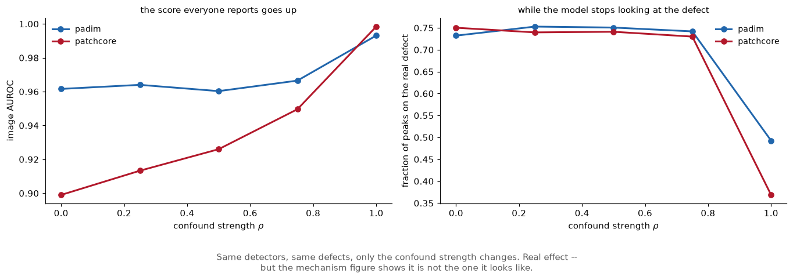
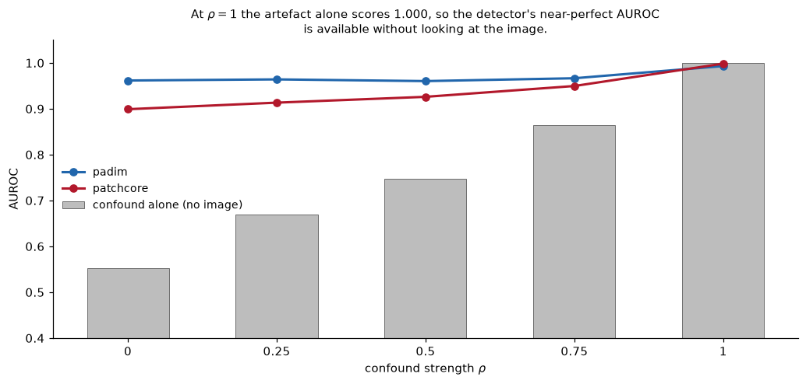
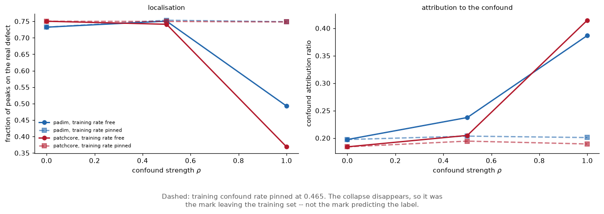
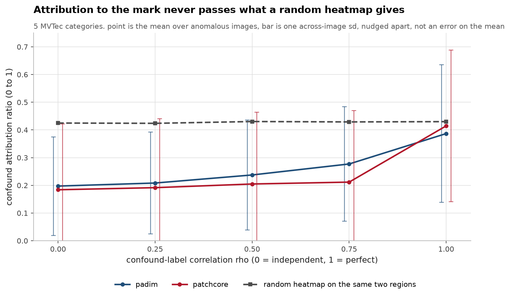
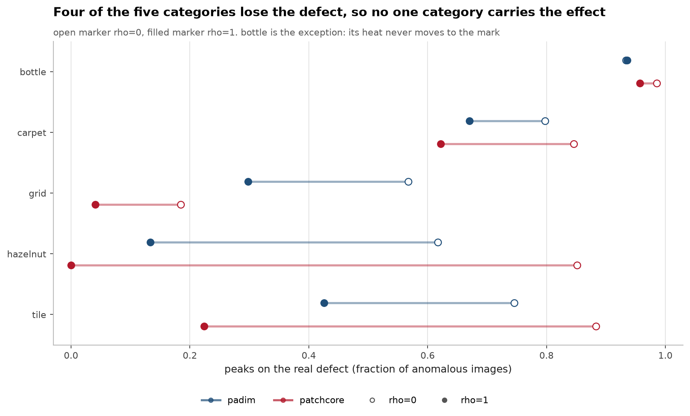
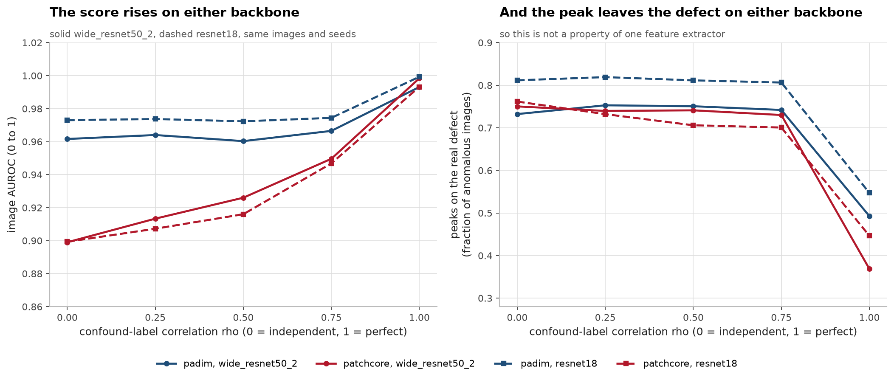

# SpuriousAD, a planted-confound benchmark that refutes its own premise

> The synthetic finding now **replicates on real MVTec images** across two
> detector families and two backbones, see [External validity](#external-validity-real-mvtec-images-two-detectors-two-backbones).
> Pinning the training-set confound rate halves CAR at perfect label
> correlation, so the effect is train-set absence, not a label shortcut.

[](https://github.com/aghasalim/spurious-ad/actions/workflows/ci.yml)
[](https://www.python.org/)
[](LICENSE)

A controlled anomaly-detection dataset where every anomalous image contains a
**true defect** and a spatially-disjoint **spurious mark** correlated with the
label, plus a metric for whether a detector's heatmap lands on the defect or the
mark. Built by a third-year Applied Computer Science (AI) student.

I built it to show that an unsupervised detector can score a perfect AUROC while
pointing at the wrong region. **It doesn't, and finding out why is the result.**

---


---

## Abstract

A natural way to build a controlled Clever Hans benchmark for unsupervised
anomaly detection is to plant an artefact that correlates with the defect label
and then measure whether the detector's heatmap moves onto it. This work builds
that benchmark, reproduces a large effect with it, and then shows the effect is
not the phenomenon it appears to be.

As the planted confound strengthens, image AUROC rises to 0.993 (PaDiM) and 0.998
(PatchCore) while the fraction of heatmap peaks landing on the real defect falls
from about 0.75 to 0.49 and 0.37. Reproducible, and present across categories and
across a backbone swap.

The ablation refutes the interpretation. Raising the confound strength does two
things at once: it makes the artefact predict the label, and it drives the
artefact out of the normal-only training set. Pinning the training confound rate
at 0.465 separates them, and with it pinned, the collapse disappears entirely,
even at the strength where the artefact predicts the label perfectly. In
hindsight this is mechanical: an unsupervised detector never sees a label, so a
label shortcut is not available to it. What it reacts to is a distributional
departure, and flagging that is arguably correct behaviour.

The contribution is therefore negative and methodological. The intuitive
construction produces a real, reproducible, 4.2x effect that has nothing to do
with the phenomenon it claims to study.

**Contributions.** (i) A planted-confound benchmark with a confound attribution
ratio and a random-attribution baseline. (ii) An ablation pinning the training
rate, which removes the effect. (iii) External validity checks across MVTec
categories, two detectors and two backbones. (iv) A negative result about how not
to construct this benchmark.

---

## 1. The headline

Sweeping confound, label correlation ρ from 0 to 1, three seeds, PatchCore-style
detector trained on normal images only (`make sweep`):

| ρ | image AUROC | CAR | CAR random control | peak on defect |
|---|---|---|---|---|
| 0.00 | **1.000** | 0.133 | 0.621 | 93.2% |
| 0.25 | **1.000** | 0.143 | 0.599 | 91.1% |
| 0.50 | **1.000** | 0.144 | 0.588 | 97.4% |
| 0.75 | **1.000** | 0.187 | 0.607 | 93.9% |
| 1.00 | **1.000** | **0.560** | 0.610 | 80.8% |

**AUROC is 1.000 at every level.** The metric the whole field reports is
perfectly blind to whether a spurious mark is driving the score, that part of
the hypothesis holds completely.

CAR (Confound Attribution Ratio, share of heat on the mark rather than the
defect) rises 4.2×. That looks like the predicted collapse. It isn't:

- CAR at ρ=1 is **0.560 against a random-heatmap control of 0.610**. The detector
  never becomes confound-*seeking*; it decays to roughly what uniform noise would
  produce, which is set by the two regions' relative areas.
- The hottest single pixel still lands on the real defect **80.8%** of the time.





## 2. Then the ablation killed the premise outright



Dashed lines are the pinned-training-rate control. The collapse disappears under
it, which is what rules out the label-shortcut reading.

Raising ρ does two things at once, and they are not the same thing:

- **A: label shortcut.** The detector exploits the mark *because it predicts the
  label*. This is the Clever Hans story.
- **B: training-set absence.** Raising ρ drives P(mark | normal) toward 0, so the
  mark stops appearing in the normal-only training set and becomes genuinely
  out-of-distribution.

Pinning the training rate at 0.465 while varying ρ separates them (`make mechanism`):

| training confound rate | ρ=0 | ρ=0.5 | ρ=1.0 |
|---|---|---|---|
| free (falls to **0.000** at ρ=1) | 0.133 | 0.144 | **0.560** |
| **pinned at 0.465** | 0.133 | 0.117 | **0.130** |

**With the training rate held fixed, CAR does not move, even at ρ=1.0, where the
mark predicts the label perfectly.** Label correlation contributes essentially
nothing. Every bit of the apparent collapse was mechanism B.

In hindsight this is obvious, which is the useful part: **an unsupervised detector
never sees a label, so a label shortcut is not mechanically available to it.**
PatchCore models P(normal) and flags departures from it. A mark that is absent
from training and present at test time genuinely *is* a departure, flagging it is
arguably correct behaviour, not a Clever Hans effect.

So the naive way to build this benchmark, plant a label-correlated confound and
measure localisation, measures the wrong thing. It produces a real, reproducible,
4.2× effect that has nothing to do with the phenomenon it claims to study.

### What this does and does not say about prior work

It does not contradict [Kauffmann et al., *The Clever Hans Effect in Unsupervised
Learning*](https://arxiv.org/abs/2408.08041). They audit models post-hoc on native
data and find Clever Hans effects arising from **inductive bias in the learning
machinery**. That is a different mechanism from label correlation, and nothing here
tests it. What this repo shows is that the intuitive way to *construct* a
controlled version of their setting does not reproduce the phenomenon, because it
smuggles in a distributional artefact instead.

It is also not a criticism of [AUPIMO](https://arxiv.org/abs/2401.01984), whose
X-axis already penalises false positives on normal images. CAR differs in having a
notion of a **specific competing region**, which is what makes "the heat went
*there* instead" measurable at all.

---

## 3. The metric



```
CAR = mass(confound) / (mass(defect) + mass(confound))
```

over a normalised heatmap, on anomalous images that carry a confound. 0 = all
evidence on the real defect, 1 = all on the spurious mark.

Three things it does deliberately:

- **Mass, not peak.** A peak-based score is decided by one pixel and is unstable
  across seeds.`peak_on_defect` is reported separately because it is the
  operator-facing question, "the tool pointed here; is the defect there?"
- **Restricted to two regions.** Absolute heat varies with contrast and detector
  calibration. A ratio between the two regions that matter is comparable across
  detectors, at the cost of ignoring diffuse background, which
`background_share` reports rather than hides (it is ~0.89 throughout, so most
  heat is in neither region, and that is worth knowing).
- **Always against a random control.** CAR has a nonzero null (~0.61 here) set by
  the regions' relative areas. Reading CAR without it would have made 0.560 look
  like catastrophic failure instead of near-chance.

---

## 4. Running it

```bash
make setup && make test
```

8 tests, all on the generator and metric, the instrument, not the model.

```bash
make sweep && make mechanism
```

CPU or Apple MPS, a few minutes each. No dataset download: the data is
generated, which is what makes exact two-region ground truth possible.

---

## 5. External validity





The synthetic result above says label correlation does not drive the confound
attribution, the CAR rise is the mark going *out of distribution* in the
normal-only training set, not the detector learning a label shortcut it cannot
mechanically learn. That is a claim about mechanism, so it has to survive real
images. It does.`make real-mechanism` runs the same planted confound on MVTec
AD, five categories (bottle, carpet, grid, hazelnut, tile), the identical
per-category random-heatmap null (which varies with region area, so it is
computed per category and never assumed).

The load-bearing test, at ρ=1.0 where the mark predicts the label perfectly
the only difference between the two rows is whether the mark stays in the
normal-only training set (`wide_resnet50_2`, 1,062 anomalous images/cell):

| detector | training rate | CAR | its null | peak on defect |
|---|---|---|---|---|
| PatchCore | free → **0.000** | **0.415** | 0.430 | 36.9% |
| PatchCore | **pinned at 0.51** | **0.189** | 0.430 | **74.8%** |
| PaDiM | free → **0.000** | 0.387 | 0.430 | 49.3% |
| PaDiM | **pinned at 0.51** | **0.201** | 0.430 | **74.9%** |

Pinning the training rate **halves CAR and doubles the peak-on-defect rate**, at
identical, perfect label correlation. With the pin in place CAR is flat across ρ.
The synthetic finding replicates on real images across **two detector families**: PatchCore (non-parametric kNN) and PaDiM (a fitted per-patch Gaussian), which
share only the "model normal, flag departures" structure the conclusion rests on.

A second backbone corroborates it. On`resnet18` (sweep only, no pin), CAR never
even reaches its null: it rises 0.21 → 0.39 as ρ goes 0 → 1 while the null sits
at 0.43, so the confound attribution stays *below chance* at every correlation
level. I did not run the pinned ablation on resnet18, the mechanism claim rests
on the`wide_resnet50_2` pin above; resnet18 only shows the effect is, if
anything, weaker on a smaller extractor.

One detail that protects the metric: the loader drops anomalous images whose
ground-truth mask touches the confound box (else the two regions overlap and CAR
is unscoreable) and masks that vanish at 256 px (a zero defect denominator would
score a spurious CAR of 1.0). Both counts are reported per result row, not
silently applied, across all 15 categories the constraint costs 0 to 8 images each.

## 6. Limitations

- **Synthetic textures are the core; MVTec is the external check.** The mechanism
  finding now holds on real images (above), but the headline synthetic CAR values
  are specific to the generator, the *ordering and the mechanism* are what
  transfer, not the exact numbers.
- **The resnet18 arm is a sweep, not the pinned ablation.** It corroborates but
  does not independently establish the mechanism claim.
- **Random subsampling, not greedy coreset selection.** Greedy k-center is
  PatchCore's efficiency contribution and does not change what the memory
  represents.
- **The negative result is the contribution.** There is no demonstration here of
  a genuine unsupervised Clever Hans effect, only a demonstration that this
  construction does not produce one.

## 7. Licence

MIT, see [LICENSE](LICENSE).
